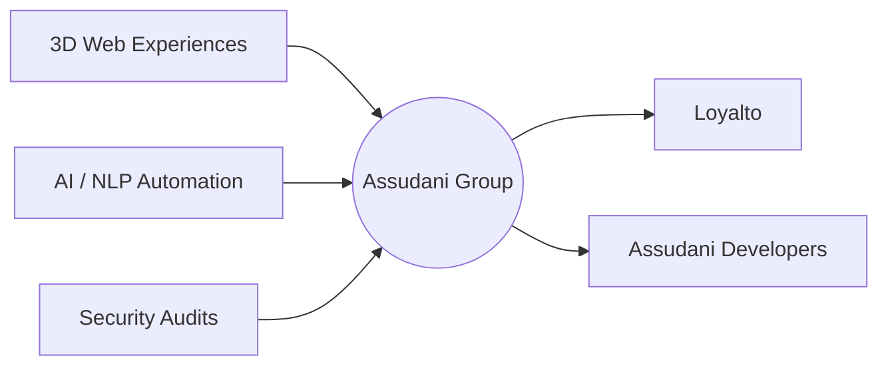

<div align="center">

# Hi, I'm Piyush Assudani 👋

### Founder @ ASSUDANI GROUP · Full-Stack Developer · 3D Web Specialist · Cybersecurity Enthusiast

I build high-performance digital products that bridge complex engineering and real business growth.
Currently leading **Loyalto** and **Assudani Developers** — focused on immersive 3D web experiences, AI automation, and secure software architecture.

🌐 **Portfolio:** [piyushassudani.in](https://piyushassudani.in) &nbsp;|&nbsp; 📧 **Email:** [piyushassudani96@gmail.com](mailto:piyushassudani96@gmail.com) &nbsp;|&nbsp; 📍 **Location:** Barmer / Jodhpur, Rajasthan

</div>

---

### 🧭 About Me

```
> whoami
Piyush Assudani — building at the intersection of engineering & business.

> current_focus
[✓] Immersive 3D portfolios for high-end clients
[✓] Custom NLP agents for automated business workflows
[✓] Security audits for local digital infrastructure

> philosophy
"Logic is the beginning of wisdom, not the end."
```

---

### 📈 Business & Impact

- 🚀 **Successful Exit** — Built and sold **CaptiAI**, an AI-powered caption engine.
- 🏫 **Client Success** — Digitized local infrastructure for **Rainbow E Smart School**, **REDS School**, and **MRK Engineers**.
- 📊 **Scaling Now** — Growing **Loyalto** (a sub-company under Assudani Group) into a full-service digital marketing & software powerhouse.

---

### 🛠️ Tech Stack & Arsenal

| Category | Tools & Technologies |
| :--- | :--- |
| **Frontend** | Next.js · React · Three.js · GSAP · Tailwind CSS |
| **Backend** | Node.js · Python (FastAPI / Flask) |
| **Mobile** | Flutter · React Native |
| **Cybersecurity** | Kali Linux · Burp Suite · Network Analysis |
| **Hardware / IoT** | ESP32 · Arduino · MicroPython |

---

### 🧪 Current Focus



- 🏗️ Building immersive 3D portfolios for high-end clients.
- 🤖 Developing custom NLP agents for automated business workflows.
- 🛡️ Conducting security audits for local digital infrastructure.

---

### 🤝 Let's Build Something

I'm open to high-stakes collaborations and custom software development through **Assudani Developers**.

<div align="center">

**[piyushassudani.in](https://piyushassudani.in)** · **[piyushassudani96@gmail.com](mailto:piyushassudani96@gmail.com)**

<sub>© Piyush Assudani · Assudani Group · Built with logic, shipped with intent.</sub>

</div>
